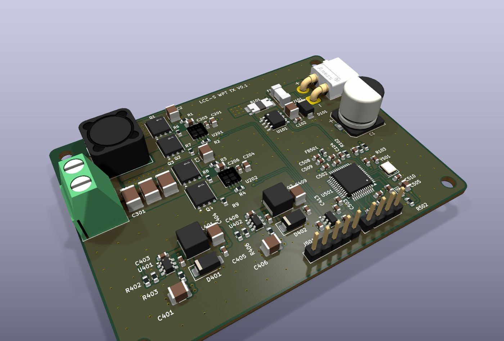
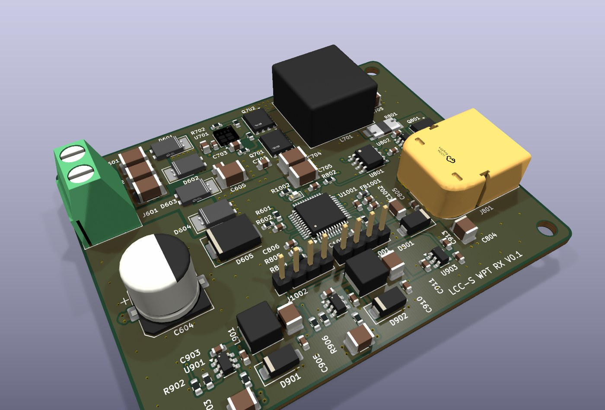
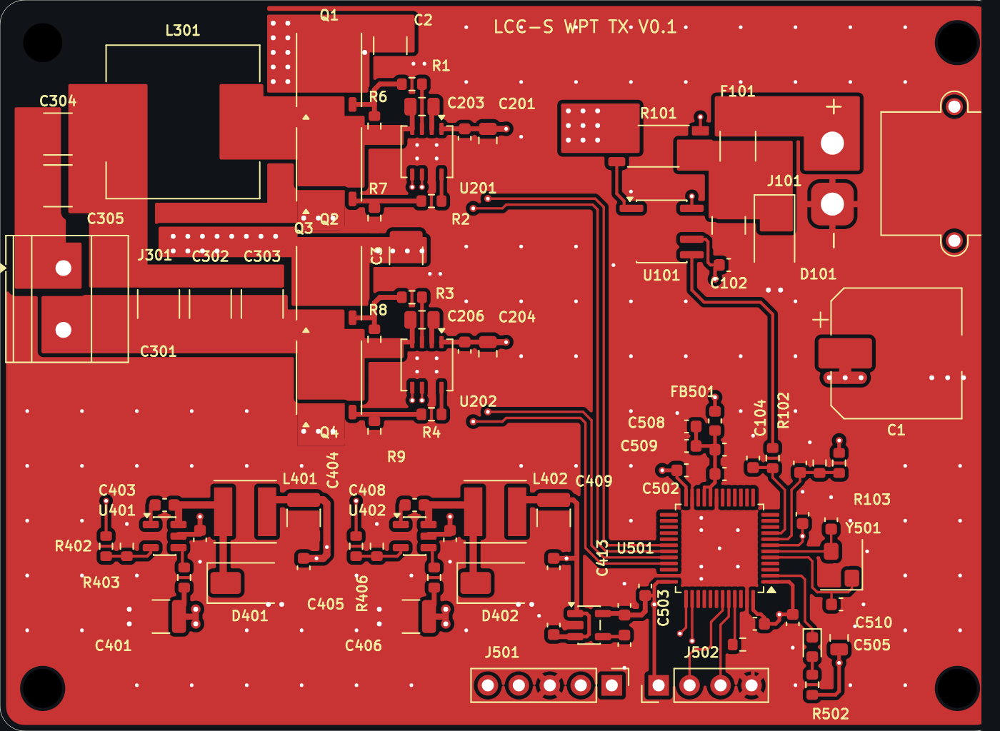
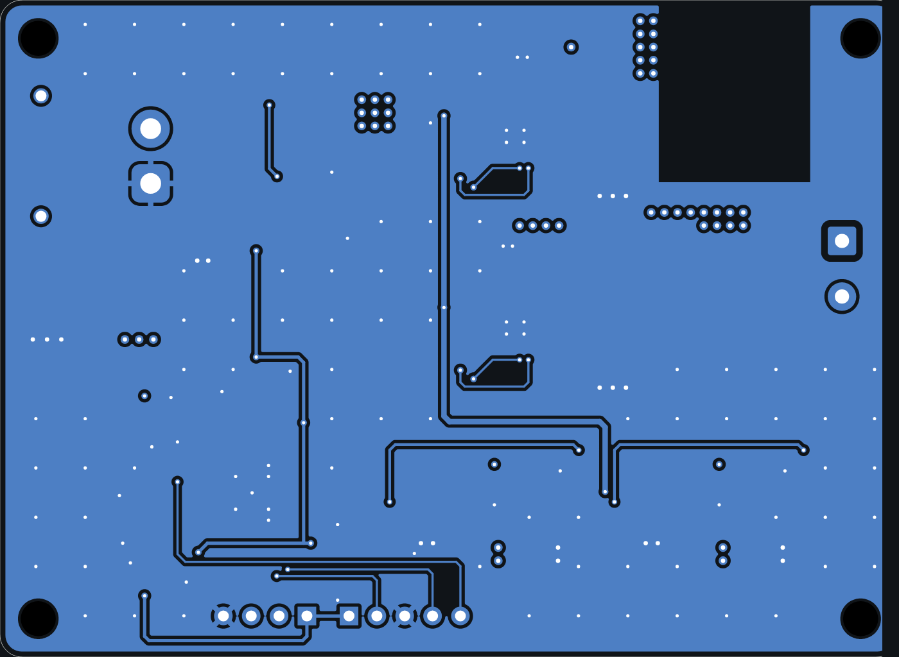
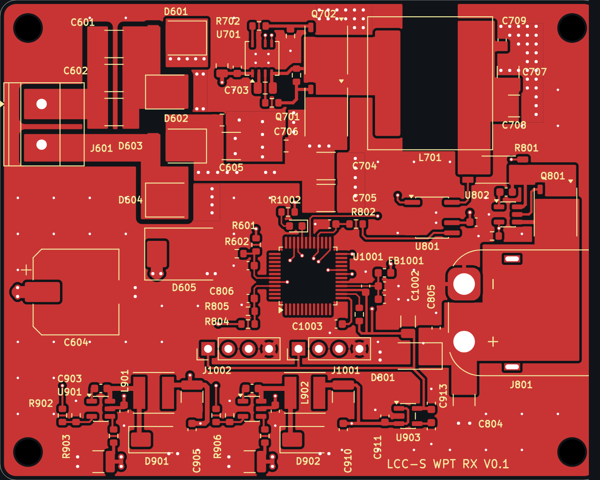
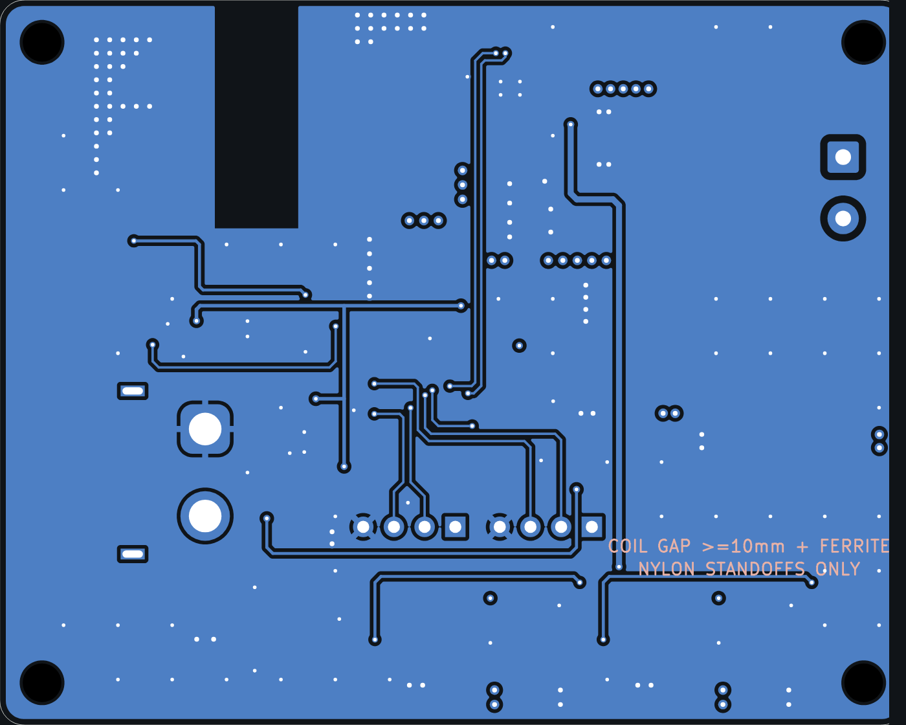
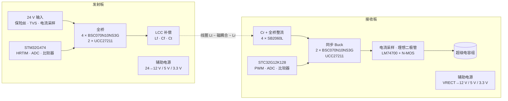

# Resonare

**120 W LCC-S 谐振式无线充电：发射板 + 接收板**

[](LICENSE)


> *Resonare* (Latin: “to resound”) is an open-source 120 W wireless charger built on an LCC-S resonant
> topology. A 24 V transmitter drives a full bridge into an LCC compensation network; the receiver rectifies,
> steps down with a synchronous buck and charges a supercapacitor bank through an ideal-diode stage.
> Both boards are 4-layer KiCad 10 designs with complete fabrication outputs.

| 发射板 TX（82 × 60 mm） | 接收板 RX（75 × 60 mm） |
|---|---|
|  |  |

### PCB 走线

| | 顶层 F.Cu | 底层 B.Cu（从背面看） |
|---|---|---|
| **发射板 TX** |  |  |
| **接收板 RX** |  |  |

第 2 层为整层地、第 3 层为整层电源（TX：VBUS；RX：VRECT），图中只画出两个外层。

---

## 目录

- [主要指标](#主要指标)
- [系统结构](#系统结构)
- [仓库结构](#仓库结构)
- [打开工程](#打开工程)
- [打样与装配](#打样与装配)
- [设计要点](#设计要点)
- [安全提示](#安全提示)
- [许可证](#许可证)
- [致谢](#致谢)

## 主要指标

| 项 | 值 |
|---|---|
| 发射端输入 | 24 V DC，XT30 接口，输入平均电流约 5.9 A（按 85 % 效率估算） |
| 输出功率 | 120 W 级（超级电容端） |
| 拓扑 | 全桥逆变 + LCC-S 补偿 |
| 逆变 / 谐振频率 | 144 kHz |
| 补偿参数 | Lf 6 µH；Lt = Lr 20 µH；Cf ≈ 203.6 nF，Ct ≈ 87.3 nF，Cr ≈ 61.1 nF（理想调谐） |
| 整流母线 VRECT | 标称 30 V |
| 接收端降压 | 同步 Buck，200 kHz，15 µH；充电电流上限 10 A（峰值约 11.2 A） |
| 负载 | 超级电容组，6–24 V，等效 10 F，XT60 接口 |
| 电流采样 | 2 mΩ 四端分流电阻 + INA240A2（×50）：10 A → 1.0 V |
| 主控 | TX：STM32G474CE（HRTIM 驱动全桥）；RX：STC32G12K128（PWM 驱动 Buck） |
| PCB | 4 层，1.6 mm，外层 2 oz / 内层 1 oz |

## 系统结构



- 发射端过流保护：INA240 输出同时进 ADC 和片内比较器（COMP1），比较器直接触发 HRTIM 故障关断。
- 接收端过流保护：充电电流进 ADC 和片内比较器，比较器阈值用片内 1.19 V 基准，对应约 11.9 A。
- 防倒灌：同步 Buck 上管的体二极管会让超级电容反向放电到 VRECT，所以输出端串联 LM74700 + N-MOS 理想二极管，由 MCU 的 `CHG_EN` 控制。
- 接收端的辅助电源只从 VRECT 取电。小车离开发射线圈后，接收端 MCU 掉电，Buck 停止，理想二极管关断。
- 发射与接收的地完全隔离（`GND` / `GND_RX`）。

更完整的说明见 [docs/design.md](docs/design.md)。

## 仓库结构

```
.
├── p1_tx/                 发射板 KiCad 工程（原理图 + PCB）
│   └── fab/               发射板生产文件（Gerber zip、BOM、坐标、装配图、DRC 报告）
├── p1_rx/                 接收板 KiCad 工程
│   └── fab/               接收板生产文件
├── p1/                    整机原理图（发射与接收在同一个工程里，作系统参考）
│   └── 3dmodels/          第三方 3D 模型的来源清单（模型文件不随仓库分发）
├── docs/
│   ├── design.md          设计说明
│   └── schematics/        原理图 PDF（不装 KiCad 也能看）
├── images/                3D 渲染图
├── CHANGELOG.md
└── LICENSE                CERN-OHL-S-2.0
```

## 打开工程

1. 安装 [KiCad](https://www.kicad.org/) **10.0** 或更新版本。
2. 打开 `p1_tx/p1_tx.kicad_pro`（发射板）或 `p1_rx/p1_rx.kicad_pro`（接收板）。自定义符号在各工程自带的 `p1_parts.kicad_sym` 里；封装全部来自 KiCad 官方库。
3. **3D 模型（可选）**：有 9 种器件的 3D 模型不在 KiCad 官方库里，版权也不允许随仓库再分发。按 [p1/3dmodels/README.md](p1/3dmodels/README.md) 下载到 `p1/3dmodels/`，3D 查看器（`Alt+3`）里就能看到完整模型。不下载也不影响原理图、PCB 和生产文件。

## 打样与装配

生产文件已经导出好，坐标原点在板的左上角：

| | 发射板 | 接收板 |
|---|---|---|
| 上传给板厂 | [`p1_tx/fab/p1_tx-gerber.zip`](p1_tx/fab/p1_tx-gerber.zip) | [`p1_rx/fab/p1_rx-gerber.zip`](p1_rx/fab/p1_rx-gerber.zip) |
| 物料清单 | [`p1_tx-bom.csv`](p1_tx/fab/p1_tx-bom.csv) | [`p1_rx-bom.csv`](p1_rx/fab/p1_rx-bom.csv) |
| 贴片坐标 | [`p1_tx-pos.csv`](p1_tx/fab/p1_tx-pos.csv) | [`p1_rx-pos.csv`](p1_rx/fab/p1_rx-pos.csv) |
| 装配图 | [`p1_tx-assembly.pdf`](p1_tx/fab/p1_tx-assembly.pdf) | [`p1_rx-assembly.pdf`](p1_rx/fab/p1_rx-assembly.pdf) |
| 下单参数 | [`p1_tx/fab/README.md`](p1_tx/fab/README.md) | [`p1_rx/fab/README.md`](p1_rx/fab/README.md) |

下单要点：

- 4 层，1.6 mm FR4，外层 2 oz、内层 1 oz，无铅喷锡，过孔盖油。
- 叠层顺序：F.Cu / In1（地）/ In2（电源：TX 为 VBUS，RX 为 VRECT）/ B.Cu。**内层顺序不能调换**。
- 最小线宽 / 线距 0.2 / 0.2 mm，最小过孔 0.5 / 0.3 mm（焊环 0.1 mm）。外层 2 oz 下请对照板厂工艺能力确认。
- 接收板有 2 个 0.6 × 1.7 mm 金属化槽孔。
- 线圈（L302、L601）在板外，BOM 里的线圈条目不贴装。安装孔 H1–H4 为 M3。
- 为了版面整洁，丝印上放不下的一些小阻容位号只保留在装配层（F.Fab），焊接时请对照装配图。

DRC 里保留了几条已接受的丝印告警：驱动器封装的 1 脚标记压在自举电容焊盘上 0.05–0.14 mm；接线端子外框到达板边。这两种情况板厂都会自动裁掉焊盘上和板外的丝印。

## 设计要点

- **栅极回路最小化**：半桥驱动器夹在上下管的栅极之间，LO / VSS 对着下管，HO 从自举电容两焊盘之间穿出，栅极电阻紧贴 MOS。
- **完整的回流平面**：第 2 层整层是地，第 3 层整层是电源。高 di/dt 的信号都走在顶层，紧贴地平面；底层贴着电源平面，只走慢信号和跨越线。
- **开尔文采样**：四端分流电阻的检测端单独引线，成对走到 INA240；ADC 的 RC 滤波放在 MCU 引脚旁。
- **功率铺铜**：开关节点铺铜面积受控，输入去耦电容紧贴 MOS 管；两面地铺铜，用缝合过孔连到地平面。
- **LCC 电感下方挖空内层**：发射端 Lf 流过全部逆变电流，其下方的内层平面挖空，避免涡流发热。接收端 Buck 电感只有纹波电流，下方平面保留，起屏蔽作用。

详见 [docs/design.md](docs/design.md)。

## 安全提示

- 谐振网络（Cf、Ct、Cr、线圈）上的电压可以远高于直流母线电压，通电时不要触碰。
- 超级电容组储能大、短路电流大：接线前先确认极性（XT60：焊盘 1 为负、焊盘 2 为正），调试时加限流。
- 首次上电请用限流电源，按“辅助电源 → MCU → 驱动 → 小功率 → 满功率”逐级进行。
- 线圈之间留足间隙，使用尼龙柱安装（接收板背面丝印有提示）。

## 许可证

本项目的硬件设计文件（原理图、PCB、生产文件、文档）采用
**[CERN Open Hardware Licence Version 2 – Strongly Reciprocal (CERN-OHL-S-2.0)](LICENSE)**。

简单说：可以自由使用、学习、修改、生产和销售；但如果你发布修改后的设计，或者销售基于它的产品，必须用同样的许可证公开对应的设计源文件。

第三方封装、符号和 3D 模型各自遵循其原始许可，不在本许可证范围内。

## 致谢

- [KiCad](https://www.kicad.org/) 及其官方符号 / 封装 / 3D 库。
- 器件 3D 模型的来源见 [p1/3dmodels/SOURCES.md](p1/3dmodels/SOURCES.md)。

欢迎通过 Issue 反馈问题或提出改进。
